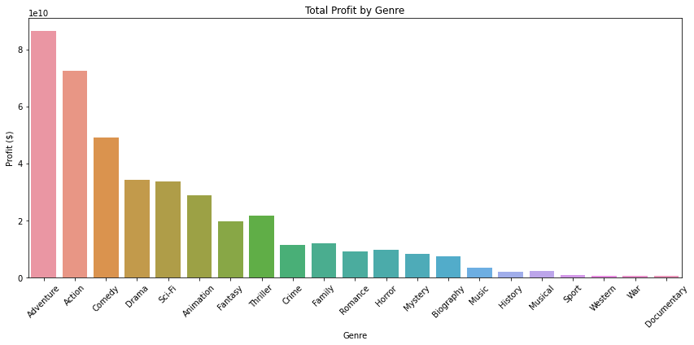
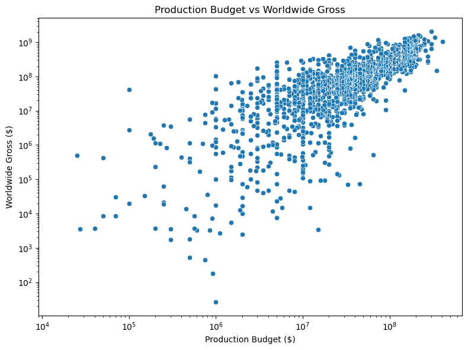
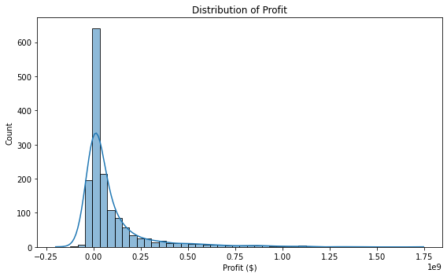
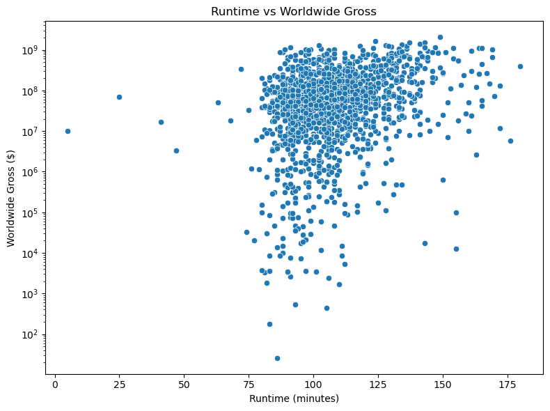
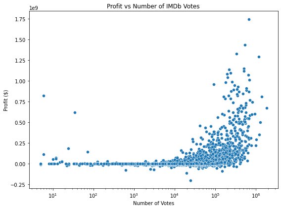
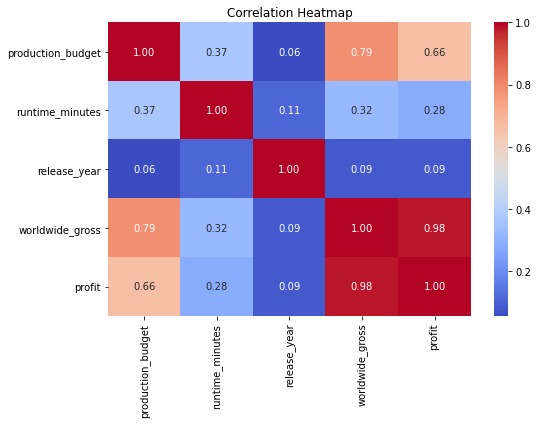

<h1 align="center">MOVIE BUSINESS ANALYSIS</h1>

Image By: [Casie](https://www.pinterest.com/pin/443745369554193647/)

## Project Structure and Navigation

- *`README.md` — Project documentation*
- *`student.ipynb`  — Jupyter notebook for analysis*
- *`Images/` — Saved plots and figures*
- *`Data/` — Dataset files*
- *`Presentation/` — Project summary slides PDF*

## Table of Contents
1. *Business Understanding*
2. *Data Understanding*
3. *Exploratory Data Analysis (EDA)*
4. *Conclusion and Recommendations*
5. *Links and Resources* - *( Data Source)*

# 1. BUSINESS UNDERSTANDING 
## Business Problem

The entertainment industry is undergoing rapid transformation, with original content emerging as a key driver of audience engagement and revenue growth. Major players like Netflix, Amazon, and other sources are heavily investing in original films —reaping substantial financial returns and strengthening their brand presence.
Recognizing this trend, Flix company has made the strategic decision to launch a new movie studio. However, it currently lacks the data-driven insights necessary to understand what factors contribute to a film’s box office success.
As data scientists, our role is to explore publicly available movie performance data to uncover patterns that indicates
what makes a movie financially successful. The goal is to provide clear data- driven, actionable recommendations that will help guide decisions about genre, budget size, release timing, and other production choices.

## Stakeholders and Use Cases
Primary Stakeholder:
Head of the New Movie Studio

Use Case:
Leverage data-driven insights to inform strategic decisions on film production. This includes identifying high-performing genres, determining optimal budget ranges, selecting ideal release windows, and shaping casting strategies—all aimed at maximizing box office success and return on investment.

## Project Objectives
* Identify which genres perform best at the box office, considering revenue and profitability.

* Analyze the impact of budget, runtime, cast, and release month on a film’s success.

* Provide actionable recommendations for the types of films the company should produce.

## Conclusion: Implications and Recommendations

This project provides a data-driven foundation to support the successful launch of Flix company’s new movie studio while reducing financial risk. By uncovering the key factors that correlate with box office success, the Head of Studio is equipped to make informed, strategic decisions, including:

* Genre Selection: Focus on genres with a strong track record of performance.

* Budget Planning: Allocate production budgets based on historically successful investment ranges.

* Release Strategy: Optimize release timing to align with peak audience engagement periods.

* Talent Strategy: Identify the cast and crew characteristics commonly linked to high-grossing films.

# 2. DATA UNDERSTANDING

## Data Sources

This project uses data from three high-quality, complementary sources of movie data:

### 1. Box Office Mojo (bom.movie_gross.csv.gz)

Provides domestic box office revenue data.

Includes key features such as: title, studio, domestic_gross, release_date, and year.

used to determine the financial performance of films.

 ### 2. TheMovieDB (TMDb) (tmdb.movies.csv.gz)

TheMovieDb entails the following:
* User-generated popularity 
* voting data

Key features: title, popularity, vote_average, vote_count, release_date, genres, budget, revenue

Purpose: Complements Box Office Mojo and IMDb with:

Popularity metrics: Show which films gain audience traction pre- and post-release

Vote data: Allows cross-comparison with IMDb ratings

### 3. IMDb(Internet Movie Database) (im.db.zip)

Contains detailed metadata about films and user-ratings.

Key tables used:

* movie_basics: Includes primary_title, original_title, genres, runtime_minutes, and start_year.

* movie_ratings: Contains user rating data (average_rating, num_votes).

used for movie characteristics and audience quality perceptions.

### 4. The Numbers (tn.movie_budgets.csv.gz)

It consits of  Film production budgets and worldwide gross

Key Features:

* Release_date, movie, production_budget, domestic_gross, worldwide_gross

Why It Matters:

* Gives a complete financial picture by providing both the cost of making the film (production budget) and revenue generated globally.

* Allows calculation of Return on Investment (ROI) — one of the most important metrics when deciding which types of films to produce.

# 3. EXPLOLATORY DATA ANALYSIS (EDA)
### a. Total Profit By Genre

This plot helps us identify the highest-earning genres in terms of raw profit.

### We are able to see the following: 

* Action, Adventure, Sci-Fi, and Fantasy genres generally show the highest total profit.These genres attract large global audiences and usually get bigger production and marketing budgets — resulting in high box office returns.
* Documentary, Music, and Experimental genres tend to have the lowest total profits, reflecting limited theatrical release, smaller audiences, and lower budgets.
* Some genres may have high movie counts but low profit totals (e.g., Drama) — meaning many such films are made but are not huge moneymakers.
* Others, like Fantasy or Sci-Fi, may have fewer movies but outsized profit contributions.

##  b. Analyze Impact of Budget, Runtime, and Number of Votes

### Our Typical Observations include:

 There is a  Positive Correlation:
   
  - Generally, higher production budgets lead to higher worldwide gross.

  - The scatter points will often trend upwards to the right, showing that spending more usually results in greater revenue but not always proportional.

  - A long tail toward the right, shows that while only a few films make huge profits, they skew the average upward.

  - This is known as a right-skewed distribution, common in industries with high risk and high reward (like the film industry).

##  c. Profit Distribution

### Our Typical Observations include:

* A sharp peak near $0 or negative values, suggests that many films either break even or lose money.

* A long tail toward the right, shows that while only a few films make huge profits, they skew the average upward.

* This is known as a right-skewed distribution, common in industries with high risk and high reward (like the film industry).

## d. Runtime vs Worldwide Gross

### From our scatter plot, we observe that:

* Scatter points are usually spread widely across all runtime values.

* A film’s length alone rarely predicts financial success.

* Many high-grossing films tend to cluster around 100–140 minutes. This is the sweet spot where blockbusters, action, and adventure films typically fall.

## e. Profit vs Number of IMDb votes

### From our observations, we find that:

* Films with more IMDb votes tend to have higher profits.

* More audience engagement (votes) often reflects wider viewership and box office success.

* The points usually trend upwards as the number of votes increases.

* Films with fewer votes (low popularity) show mixed profit outcomes — some lose money, while some gain.

* Films with very high IMDb votes (i.e., >100,000) almost always have positive profits.

## f. Correlation Heatmap

### From our correlation heatmap we are able to observe that: 

1. There is a strong Positive Correlation:

* production_budget vs worldwide_gross: High Positive Correlation (~0.6 to 0.8)

  Bigger budget films tend to earn higher worldwide gross — large-scale marketing, global releases, big-name casts drive this.

* production_budget vs profit: Moderate Positive Correlation

  Higher budgets may lead to higher profit, but not always guaranteed — profits also depend on cost control and reception.

2. We have a very Strong Positive Correlation (close to 1.0)

* worldwide_gross vs profit

  Profit is largely driven by worldwide gross, as expected. This is natural since profit = worldwide gross - production budget.

3. We also have a Weak or No Correlation:

* runtime_minutes shows very low or negligible correlation with both profit and gross.

  Confirms earlier finding: runtime does not significantly drive revenue or profit on its own.

* release_year has low correlation with other variables.

  Implies no strong trend over the years regarding budgets or profits in this dataset — unless the time window includes massive shifts (e.g., pandemic years).

4. There is a possible Weak Positive Trend:

   Sometimes release_year vs production_budget shows a slight positive correlation — indicating that film budgets have gradually risen over the years.

## g. Hypotheses Testing

This is a one-tailed independent t-test comparing the average ratings of Action vs. non-Action movies.

#### Null Hypothesis (H₀):

Action movies do not have significantly higher average ratings than non-Action movies.
 
#### Alternative Hypothesis (H₁):

Action movies have significantly higher average ratings than non-Action movies.

### Hypothesis Testing Results
T-statistic: -0.7174
One-tailed P-value: 0.2367
Fail to reject the null hypothesis: No significant evidence that Action movies have higher ratings.

### Hypothesis Testing Explanation
If the p-value is less than alpha and the t-statistic is positive (i.e., Action movies have a higher mean), it rejects the null hypothesis, indicating statistical evidence that Action movies are rated higher.

Otherwise, it fails to reject the null, meaning there's no strong evidence for a difference in the expected direction.

### Hypothesis finding

Fail to reject the null hypothesis: No significant evidence that Action movies have higher ratings.

# 4. CONCLUSION & RECOMMENDATIONS
Recommendations:
1. Focus on Action, Adventure, and Sci-Fi genres which have the highest gross and profit.
2. Films with higher budgets generally earn more, but profit should be considered carefully.
3. Optimal runtimes appear around 120-150 minutes for blockbuster success.
4. Build hype early to raise IMDb vote count, improving engagement and potentially profit.

# 5. LINKS AND RESOURCES

- **Dataset Source** :  [Box Office Mojo](https://www.boxofficemojo.com/) ,
                        [IMDB](https://www.imdb.com/) , [TheMovieDB](https://www.themoviedb.org/), [The Numbers](https://www.the-numbers.com/)

